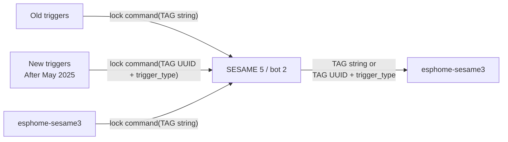
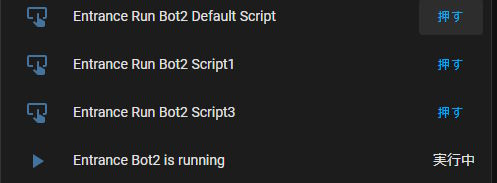
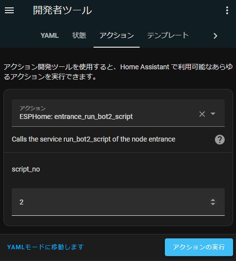

# esphome-sesame3

[ESPHome](https://esphome.io/) Smart Lock component for CANDY HOUSE [SESAME 5](https://jp.candyhouse.co/products/sesame5) / [SESAME 5 PRO](https://jp.candyhouse.co/products/sesame5-pro) / [SESAME Bot 2](https://jp.candyhouse.co/products/sesamebot2) / SESAME bot / SESAME 3 / SESAME 4 / SESAME Bike, control via Bluetooth LE

> [!NOTE]
> This component does not use ESPHome's built-in `BTClient`
> functionality. Therefore, this component cannot coexist with other BLE
> components on the same ESP32. Use this component with a separate ESP32 device
> from other BLE components.

# ESPHome version requirement

You need ESPHome 2025.7.0 or later to build this component. To use with versions between 2025.5.0 and 2025.6.3 see [below](#use-with-esphome-before-202570).

# Setup this component

You need to add compiler / library options to ESPHome base configuration, and `external_components` section link to this component.

```yaml
esphome:
  platformio_options:
    build_flags:
      - -Wall -Wextra
      - -DMBEDTLS_DEPRECATED_REMOVED -DCONFIG_BT_NIMBLE_ROLE_BROADCASTER_DISABLED -DCONFIG_BT_NIMBLE_ROLE_PERIPHERAL_DISABLED
# Configure the maximum number of connections as required
      - -DCONFIG_BT_NIMBLE_MAX_CONNECTIONS=4
      - -DCONFIG_MBEDTLS_CMAC_C	-DUSE_FRAMEWORK_MBEDTLS_CMAC
  min_version: 2025.7.0

esp32:
  board: esp32-c3-devkitm-1
  framework:
    type: arduino

external_components:
  - source:
      type: git
      url: https://github.com/homy-newfs8/esphome-sesame3
      ref: v0.19.0
    components: [ sesame, sesame_ble ]
```

Select the ESP32 board you want to use. Arduino framework is required.

If you want to use more than four SESAME devices with one ESP32 module, edit the `CONFIG_BT_NIMBLE_MAX_CONNECTIUONS` parameter (It might be a good idea to check the free memory with ESPHome's [Debug](https://esphome.io/components/debug.html) component).

## Use with ESPHome before 2025.7.0
If you wanat to use with ESPHome version 2025.5.0～2025.6.3 replace esphome: section with below.
(More older versions of ESPHome was supported by old versions of this component (not documented))

```
esphome:
  platformio_options:
    build_flags:
      - -std=gnu++17 -Wall -Wextra
      - -DMBEDTLS_DEPRECATED_REMOVED -DCONFIG_BT_NIMBLE_ROLE_BROADCASTER_DISABLED -DCONFIG_BT_NIMBLE_ROLE_PERIPHERAL_DISABLED
# Configure the maximum number of connections as required
      - -DCONFIG_BT_NIMBLE_MAX_CONNECTIONS=4
    build_unflags:
      - -std=gnu++11
  min_version: 2025.5.0
```

# Configure for your SESAME

## Minimum configuration

```yaml
sesame:
  model: sesame_5
  # 6 bytes colon separated Bluetooth address
  address: "ab:cd:ef:01:02:03"
  # 16 bytes binary in hexadecimal
  secret: "0123456789abcdef0123456789abcdef"
  # 64 bytes binary in hexadecimal (Empty for SESAME 5 / PRO)
  public_key: ""
  lock:
    id: lock_1
    name: Lock1
    tag: "My awesome system"
```

If define `id:` of `sesame:` component, it will be used as logging prefix.

```yaml
sesame:
  id: sesame1
  model: sesame_5
    ⋮
```
```
[05:23:27][D][sesame1:317]: connecting
[05:23:31][D][sesame1:321]: connect done
[05:23:31][I][sesame1:283]: Authenticated by SESAME
```

## Configuration variables

* **model** (**Required**): Model of SESAME. Use one of: `sesame_5`, `sesame_5_pro`, `sesame_bot_2`, `sesame_touch`, `sesame_touch_pro`, `remote`, `sesame_4`, `sesame_3`, `sesame_bot`, `sesame_bike`
* **address** (**Required**, string): See [below](#identify-parameter-values-for-sesame-devices).
* **secret** (**Required**, string): See [below](#identify-parameter-values-for-sesame-devices).
* **public_key** (**Required** for SESAME OS2 models, string): See [below](#identify-parameter-values-for-sesame-devices).
* **timeout** (*Optional*, [Time](https://esphome.io/guides/configuration-types#config-time)): Connection to SESAME timeout value. Defaults to `10s`.
* **connect_retry_limit** (*Optional*, int): Specifies the number of connection failures before reboot the ESP32 module. Defaults to `0` (do not reboot).
* **always_connect** (*Optional*, bool): Keep connection with SESAME. Must be `true` when this component contains `lock` object. Defaults to `true`. If set to `false`, disconnect from SESAME after receiving the status (and reconnect if `update_interval` is set).
* **update_interval** (*Optional*, [Time](https://esphome.io/guides/configuration-types#config-time)): Request SESAME to send current status with this interval. Some devices (SESAME Touch) do not send updated status without this option. Defaults to `never`.
* **lock** (*Optional*, sesame_lock): Lock specific configurations. See [below](#lock-specific-variables).
* **bot** (*Optional*, sesame_bot): Bot specific configurations. See [below](#bot-specific-settings-from-v0110)

### Expose SESAME status as sensors

* **battery_pct** (*Optional*, [Sensor](https://esphome.io/components/sensor/#config-sensor)): See [below](#expose-sesame-battery-information-as-sensor-value)
	* **name** (**Required**, string): The name of the battery level sensor.
	* All other options from [sensor](https://esphome.io/components/sensor/#config-sensor)
* **battery_voltage** (*Optional*, [Sensor](https://esphome.io/components/sensor/#config-sensor)): See [below](#expose-sesame-battery-information-as-sensor-value)
	* **name** (**Required**, string): The name of the voltage sensor.
	* All other options from [sensor](https://esphome.io/components/sensor/#config-sensor)
* **battery_critical** (*Optional*, [Binary Sensor](https://esphome.io/components/binary_sensor/#base-binary-sensor-configuration)): SESAME battery critical state is exposed as a binary sensor.
	* **name** (**Required**, string): The name of connection sensor.
  * All other options from [binary_sensor](https://esphome.io/components/binary_sensor/#base-binary-sensor-configuration)
* **connection_sensor** (*Optional*, [Binary Sensor](https://esphome.io/components/binary_sensor/#base-binary-sensor-configuration)): SESAME connection state is exposed as a binary sensor.
	* **name** (**Required**, string): The name of connection sensor.
  * All other options from [binary_sensor](https://esphome.io/components/binary_sensor/#base-binary-sensor-configuration)

## Lock specific variables

For lock devices (`sesame_5`, `sesame_5_pro`, `sesame_4`, `sesame_3`, `sesame_bot`, `sesame_bike`), lock functionality can be used.

In addition to base [Lock](https://esphome.io/components/lock/#base-lock-configuration) variables:

* **tag** (*Optional*, string): Tag value recorded on operation history. Defaults to "ESPHome". If you want to use various tag values on automation, see [below](#using-various-tag-values-on-operation).
* **history_tag** (*Optional*, [Text Sensor](https://esphome.io/components/text_sensor/#base-text-sensor-configuration)): See [below](#operation-history-tag-and-history-type)
  * **name** (**Required**, string): The name of the history tag text_sensor.
  * All other options from [text_sensor](https://esphome.io/components/text_sensor/#base-text-sensor-configuration)
* **history_type** (*Optional*, [Sensor](https://esphome.io/components/sensor/#config-sensor)): See [below](#operation-history-tag-and-history-type)
  * **name** (**Required**, string): The name of the history type sensor.
  * All other options from [sensor](https://esphome.io/components/sensor/#config-sensor)
* **trigger_type** (*Optional*, [Sensor](https://esphome.io/components/sensor/#config-sensor)): See [below](#operation-history-tag-and-history-type)
  * **name** (**Required**, string): The name of the history type sensor.
  * All other options from [sensor](https://esphome.io/components/sensor/#config-sensor)
* **fast_notify** (*Optional*, bool): Notify lock status immediately on detecting status changed. If false and `history_tag` or `history_type` defined, lock notification is postponed until history information has been received. Default is `false`.
* **unknown_state_alternative** (*Optional*, lock_state): If the lock state of SESAME is unknown (for example, before connecting or during disconnection), this module notifies HomeAssistant of the `NONE` state. Currently, HomeAssinstant seems to treat the `NONE` state as "Unlocked". <br/>
If you don't want it to be treated as "Unlocked", you can send the unknown state as any other state (candidates: `NONE`, `LOCKED`, `UNLOCKED`, `JAMMED`, `LOCKING`, `UNLOCKING`). If not set as this variable, this module will not send `LOCKING` and `UNLOCKING`, so you can write automation scripts that interpret these values as "UNKNOWN".
* **unknown_state_timeout** (*Optional*, [Time](https://esphome.io/guides/configuration-types#config-time)): If you do not want disconnection from SESAME to be immediately treated as unknown, set a timeout value with this variable. Defaults to `20s`.

## Bot specific settings (From v0.11.0)

For `sesame_bot`, you can specify [lock](#lock-specific-variables) or [bot](#bot-specific-settings-from-v0110).
For `sesame_bot_2`, [bot](#bot-specific-settings-from-v0110) can be used.
See [bot usage](#sesame-bot-usage) for detailed example.

* **bot**: Bot settings section marker.
  * **id** (*Optional*, string): Specify the ID for code generation.
  * **running_sensor** (*Optional*, [Binary Sensor](https://esphome.io/components/binary_sensor/index.html#base-binary-sensor-configuration)): Expose `ON` value while Bot is running.

## Identify parameter values ​​for SESAME devices

### `address` (Bluetooth LE MAC Address)

You can identify your SESAME address by using ESPHome BLE tracker with `sesame_ble` component. First, remove `sesame:` component definition and add below to your configuration:

```yaml
logger:

sesame_ble:
```
(`logger` must be specified for logging output)

Upload and restart ESP32, logging message contains discovered SESAME devices information:

```
[08:20:23][I][sesame_ble:107]: 01:02:03:04:05:06 SESAME 5 UUID=01020304-0102-0102-0102-010203040506
```

Colon separated 6 bytes is Bluetooth address, if you have multiple SESAME devices, distinguish with UUID (You can check the UUID of a SESAME using the SESAME smartphone app).

Configuration for this device will be:

```yaml
sesame:
  address: 01:02:03:04:05:06
```

> [!NOTE] `sesame` component cannot coexist with other BLE components
> including `esp32_ble_tracker`. Once you have identified SESAME's BLE address,
> you will need to remove the above configuration.</b>

### `secret` (Secret key of your SESAME)

Secret is PSK for authentication and encryption. You can retrieve your SESAME's secret from QR code shown on SESAME smartphone app.

#### Easy way

Use [sesame-qr-reader](https://sesame-qr-reader.vercel.app/). Display `Owner` or `Manager` key on SESAME smartphone app, then upload the QR code image. Use the displayed `Secret Key` value.

#### DIY way

Display `Owner` or `Manager` key and decode the QR code with any QR decoder. Decoded string is URI like below:

```URI
ssm://UI?t=sk&sk=BQECAwQFBgcICQoLDA0ODxAREhMUFRYXGBkaGxwdHh8gISIjJCUm&l=1&n=セサミ 5
```
Query parameter `sk` is `base64` encoded binary data
(if `sk` value contains `%2A` or `%2F`, replace them with `+` or `/`).

Above base64 string is decoded as below:

```HEX
00000000  05 01 02 03 04 05 06 07  08 09 0a 0b 0c 0d 0e 0f  |................|
00000010  10 11 12 13 14 15 16 17  18 19 1a 1b 1c 1d 1e 1f  |................|
00000020  20 21 22 23 24 25 26                              | !"#$%&|
```

First one byte is model number: 0 = SESAME 3, 2 = SESAME bot, 5 = SESAME 5, and so on. And following 16 bytes are the secret.

The example data above shows that the model is `SESAME 5` and the secret is 16 bytes from `01` to `10`. So, configuration is:

```yaml
sesame:
  address: 01:02:03:04:05:06
  secret: "0102030405060708090a0b0c0d0e0f10"
```

On SESAME OS2 devices (SESAME 3 / SESAME 4 / SESAME bot / SESAME bike), `sk` is more long string and decoded binary is 99 bytes. Still the location and length of secret is the same.


### `public_key` (Public key for SESAME OS2 devices)

Public key for encryption. Do not specify this parameter for SESAME OS3 devices (SESAME 5 / SESAME 5 PRO / SESAME Bot 2 / SESAME Touch / SESAME Touch PRO / CANDY HOUSE Remote).

On OS2 devices, you can retrieve key value from QR code.

### Easy way

As above, use [sesame-qr-reader](https://sesame-qr-reader.vercel.app/). Use `Public Key` value.

### DIY way

Decoded OS2 QR code is:

```
ssm://UI?t=sk&sk=AAECAwQFBgcICQoLDA0ODxAREhMUFRYXGBkaGxwdHh8gISIjJCUmJygpKissLS4vMDEyMzQ1Njc4
OTo7PD0+P0BBQkNERUZHSElKS0xNTk9QUVJTVFVWV1hZWltcXV5fYGFi&l=1&n=セサミ 3
```

Base64 decoded sk value is:

```HEX
00000000  00 01 02 03 04 05 06 07  08 09 0a 0b 0c 0d 0e 0f  |................|
00000010  10 11 12 13 14 15 16 17  18 19 1a 1b 1c 1d 1e 1f  |................|
00000020  20 21 22 23 24 25 26 27  28 29 2a 2b 2c 2d 2e 2f  | !"#$%&'()*+,-./|
00000030  30 31 32 33 34 35 36 37  38 39 3a 3b 3c 3d 3e 3f  |0123456789:;<=>?|
00000040  40 41 42 43 44 45 46 47  48 49 4a 4b 4c 4d 4e 4f  |@ABCDEFGHIJKLMNO|
00000050  50 51 52 53 54 55 56 57  58 59 5a 5b 5c 5d 5e 5f  |PQRSTUVWXYZ[\]^_|
00000060  60 61 62                                          |`ab|
```

publik_key is the 64 bytes following the secret, so public_key configuration is:

```yaml
sesame:
  address: 01:02:03:04:05:06
  secret: "0102030405060708090a0b0c0d0e0f10"
  public_key: "1112131415161718191a1b1c1d1e1f202122232425262728292a2b2c2d2e2f303132333435363738393a3b3c3d3e3f404142434445464748494a4b4c4d4e4f50"
```

# Expose SESAME battery information as sensor value

You can expose SESAME battery remaining percentage and voltage value, then show on your dashboard, use with your automation and etc. (in ESPHome and HomeAssistant)


```yaml
sesame:
    ⋮
  battery_pct:
    name: "Lock1_battery_level"
  battery_voltage:
    name: "Lock1_battery_voltage"
```
# Operation History TAG and History type

> [!NOTE] As of the May 2025 firmware, the TAG string specification for CANDY HOUSE devices has changed. See [TAG UUID](#history-tag-uuid-and-trigger-type).

You can expose who or what operated SESAME. These values are updated before lock/unlock state. Therefore, you can use history values in your automation's lock state change actions (You can change this "notify state after tag" behavior by `fast_notify` option).

```yaml
sesame:
    ⋮
  lock:
    history_tag:
      name: "Lock1_history_tag"
    history_type:
      name: "Lock1_history_type"
```

History is Lock specific feature, so define these sensors under `lock:` object.

## TAG string

* User name of SESAME smartphone app
* Registered fingerprint name of SESAME Touch
* `tag` value of this module
* Other API argument (Official Web API, SDK, etc.)

## Type value

| Value | Name                  | Comment                                                        |
| ----: | --------------------- | -------------------------------------------------------------- |
|     0 | NONE                  |                                                                |
|     1 | BLE_LOCK              | By BT API (Smartphone app, SESAME Touch, this component, etc.) |
|     2 | BLE_UNLOCK            | By BT API (Smartphone app, SESAME Touch, this component, etc.) |
|     3 | TIME_CHANGED          |                                                                |
|     4 | AUTOLOCK_UPDATED      |                                                                |
|     5 | MECH_SETTING_UPDATED  |                                                                |
|     6 | AUTOLOCK              |                                                                |
|     7 | MANUAL_LOCKED         | By hand                                                        |
|     8 | MANUAL_UNLOCKED       | By hand                                                        |
|     9 | MANUAL_ELSE           |                                                                |
|    10 | DRIVE_LOCKED          | SESAME bot / SESAME 3 / SESAME 4                               |
|    11 | DRIVE_UNLOCKED        | SESAME bot / SESAME 3 / SESAME 4                               |
|    12 | DRIVE_FAILED          | (SESAME bot) / SESAME 3 / SESAME 4                             |
|    13 | BLE_ADV_PARAM_UPDATED |                                                                |
|    14 | WM2_LOCK              | By smartphone app (via Wi-Fi Module 2)                         |
|    15 | WM2_UNLOCK            | By smartphone app (via Wi-Fi Module 2)                         |
|    16 | WEB_LOCK              | By [Official Web API](https://doc.candyhouse.co/ja/SesameAPI/) |
|    17 | WEB_UNLOCK            | By [Official Web API](https://doc.candyhouse.co/ja/SesameAPI/) |
|    18 | BLE_CLICK             | SESAME bot (Not listed in Android API)                         |
|    21 | DRIVE_CLICKED         | SESAME bot (Not listed in Android API)                         |

## History TAG UUID and trigger type

In the original specification, trigger devices (Touch, Remote, Open Sensor) sent their own name or the registered trigger (fingerprint, IC card) name to the SESAME lock/bot. In May 2025, this specification was changed, and trigger devices now send UUIDs instead of their own names or trigger names (and of cource Face).

A similar change was applied to history retrieval. Therefore, there are two types of history tag values ​​that this component receives (the value of the history type does not seem to have changed).

1. Literal string (0～30letters)
1. UUID (128bits) + Trigger type




On ESPHome, your can determine which type is received by `trigger_type` value.

```yaml
# define lock
sesame:
  model: sesame_5
  lock:
    id: lock_1
    history_tag:
      id: history_tag_1
      name: history tag 1
    history_type:
      id: history_type_1
      name: history type 1
    trigger_type:
      id: trigger_type_1
      name: trigger type 1
      on_value:
      then:
      - lambda: |-
          if (std::isnan(id(trigger_type_1).state)) {
            // TAG string received
            ESP_LOGD("test", "tag string = %s", id(history_tag_1).state.c_str());
          } else {
            // TAG UUID + trigger_type received
            ESP_LOGD("test", "uuid = %s, type = %d", id(history_tag_1).state.c_str(), (int)id(trigger_type_1).state);
          }

```

### trigger type values

Currently observed values.

| Value | Name                               | Device       |
| ----: | ---------------------------------- | ------------ |
|     0 | IC Card                            | Touch / Face |
|     1 | Fingerprint                        | Face         |
|     3 | Face                               | Face         |
|     4 | Vein                               | Face         |
|     6 | Fingerprint / Fingerprint failure  | Touch        |
|     7 | Open Sensor                        | Open Sensor  |
|     9 | Fingerprint failure / Close button | Face         |
|    10 | CANDY HOUSE Remote                 | Remote       |
|    11 | CANDY House Remote nano            | Remote nano  |
|    14 | ANDROID_USER_BLE                   | Android      |
|    16 | ANDROID_USER_WIFI                  | (from SDK)   |


# SESAME bot usage

## As lock device

When `lock` setting is specified for `sesame_bot` device, you can use `lock.open` action in addition to `lock.lock` and `lock.unlock` actions. `lock.open` performs the same action as tapping the button on the smartphone SESAME app.

```yaml
sesame:
  model: sesame_bot
    ⋮
  lock:
    name: some name
```

## Run the script directory

The `sesame_bot_2` device cannot be used as `lock` device. You can specify `bot` settings instead.

```yaml
sesame:
  model: sesame_bot_2
    ⋮
  bot:
    id: bot_2
    running_sensor:
      name: Bot2 is running
```

The id `bot_2` can be referenced from lambda sections (see [below](#define-bot-buttons-on-esphome) and [below](#define-bot-service-callable-from-homeassistant)).

The `sesame_bot` devices can also be used with the `bot` settings.

When used with the `bot` setting, the device will not expose the lock functionality (Lock/Unlock buttons will not automatically appear in Home Assistant).

To control a Bot, actions must be defined. You can define action button or API service.

### Define Bot buttons on ESPHome

SESAME bot 2 has 10 moving scripts (Can edit on smartphone app). Define button on specific script as follows (Script numbers range from 0 to 9 for `sesame_bot_2` devices, and from 0 to 2 for `sesame_bot` devices).

```yaml
button:
- platform: template
  name: "Run Bot2 Script1"
  on_press:
  - lambda: |-
      id(bot_2).run(0);
- platform: template
  name: "Run Bot2 Script3"
  on_press:
  - lambda: |-
      id(bot_2).run(2);
- platform: template
  name: "Run Bot2 Default Script"
  on_press:
  - lambda: |-
      id(bot_2).run();
```

Call `run()` without argument invoke the default script (Selected by smartphone app).

On Home Assistant above buttons appear as follows:



The `running_sensor` value is also shown (Bot2 is running).

### Define Bot service callable from HomeAssistant

```yaml
api:
  services:
  - service: run_bot2_script
    variables:
      script_no: int
    then:
      lambda: |-
        id(bot_2).run(script_no);
```

Above service can be called from Home Assistant as below:




# Using various tag values on operation

SESAME records the TAG string of each operation in the operation history. If you want to use different TAG values for automation, call `lock`, `unlock`, `click` functions directory from [lambda](https://esphome.io/guides/automations#config-lambda). Below is a sample service definition that can be called from [Home Assistant](https://www.home-assistant.io/).

```yaml
esphome:
  name: entrance
api:
  services:
  - service: sesame_with_tag
    variables:
      is_lock: bool
      tag: string
    then:
      lambda: |-
        if (is_lock) {
          id(lock_1).lock(tag);
        } else {
          id(lock_1).unlock(tag);
        }

sesame:
    ⋮
  lock:
    id: lock_1
    name: Lock1
      ⋮
```
This service will be seen as `esphome.entrance_sesame_with_tag` on Home Assistant ("entrance" is the entity name of ESPHome device).

```yaml
# Example Home Assistant Service Call to toggle lock
service: esphome.entrance_sesame_with_tag
data:
  is_lock: "{{ not is_state('lock.entrance_lock1', 'locked') }}"
  tag: "***Anything***"
```

# Full example configuration file

See [sesame.yaml](../sesame.yaml).

`wifi_ssid`, `wifi_passphrase`, `sesame_pubkey`, `sesame_secret`, `sesame_address` must be set according to your configuration. If you know how to use `secrets.yaml`, use it. If you don't, edit `sesame.yaml` (Remove `!secret ` when replace values).

# Avoid WiFi issues

This module starts connecting to SESAME after the WiFi connection when ESPHome starts, so it should not interfere with the WiFi connection.

If this module seems to be interfering with your WiFi connection, please try the following settings.

```yaml
sesame:
  setup_priority: 0
    ⋮
```

This setting defers the connection to SESAME until the very end of ESPHome's initialization.

# Schema changed on 0.10.0

There are big structural changes in configuration YAML. It's not difficult to convert to new schema, for example:

OLD:
```yaml
esphome:
  libraries:
    - https://github.com/homy-newfs8/libsesame3bt#0.16.0
    ⋮
external_components:
- source:
    type: git
    url: https://github.com/homy-newfs8/esphome-sesame3
    ref: v0.9.0
  components: [ sesame_lock, sesame_ble ]

lock:
- platform: sesame_lock
  name: Lock1
  id: lock_1
  model: sesame_5
  tag: "My awesome system"
  address: "ab:cd:ef:01:02:03"
  secret: "0123456789abcdef0123456789abcdef"
  battery_pct:
    name: Lock1_battery_level
  history_tag:
    name: Lock1_history_tag
```

NEW:
```yaml
esphome:
  libraries:
    - https://github.com/homy-newfs8/libsesame3bt#0.21.0
    ⋮
external_components:
- source:
    type: git
    url: https://github.com/homy-newfs8/esphome-sesame3
    ref: v0.12.0
  components: [ sesame, sesame_ble ]

sesame:
  model: sesame_5
  address: "ab:cd:ef:01:02:03"
  secret: "0123456789abcdef0123456789abcdef"
  battery_pct:
    name: Lock1_battery_level
  lock:
    name: Lock1
    id: lock_1
    tag: "My awesome system"
    history_tag:
      name: Lock1_history_tag
```
In summary,

* Update libsesame3bt version.
* External component name changed from `sesame_lock` to `sesame`.
* Definition starts with `sesame:` object.
* Lock-specific settings have been moved under the `lock:` object.
* Non-locking devices (such as SESAME Touch / Remote) are supported. There is no need to define a `lock:` object for such devices.

If you want to control multiple SESAME devices by one ESP32, define multiple `sesame` objects:

```yaml
sesame:
- id: lock1
  model: sesame_5
  address: "ab:cd:ef:01:02:03"
  secret: "0123456789abcdef0123456789abcdef"
  battery_pct:
    name: Lock1_battery_level
  lock:
    name: Lock1
    id: lock_1
    tag: "My awesome system"
    history_tag:
      name: Lock1_history_tag
- id: touch1
  model: sesame_touch
  address: "12:34:56:78:9a:bc"
  secret: "0123456789abcdef0123456789abcdef"
  battery_pct:
    name: Touch1_battery_level
  update_interval: 12h
```
The `id:` of the `sesame` object is not required. However, it is used as a logging prefix, which is useful for troubleshooting in multiple device environments.

# Related

* SESAME access library for ESP32 [libsesame3bt](https://github.com/homy-newfs8/libsesame3bt)
* SESAME 5 / SESAME 5 PRO Smart Lock [CANDY HOUSE](https://jp.candyhouse.co/products/sesame5) (SESAME 3 and 4 are End of Sale)
