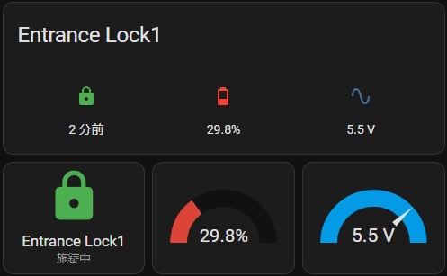

# esphome-sesame3

[ESPHome](https://esphome.io/) Smart Lock component for CANDYHOUSE [SESAME 5](https://jp.candyhouse.co/products/sesame5) / [SESAME 5 PRO](https://jp.candyhouse.co/products/sesame5-pro) / [SESAME bot](https://jp.candyhouse.co/products/sesame3-bot) / SESAME 3 / SESAME 4 / SESAME Bike, control via Bluetooth LE

## Warning: Before use this component

This component does not use the standard `BTClient` functionality of ESPHome. Therefore, this component cannot coexist with other BLE components in ESPHome. Use this module on a separate ESP32 device.

# Setup this component

You need to add compiler / library options to ESPHome base configuration, and `external_components` section link to this component.

```yaml
esphome:
  libraries:
    - https://github.com/homy-newfs8/libsesame3bt#0.11.0
    - davetcc/TaskManagerIO @ ^1.4.0
  platformio_options:
    build_flags:
      - -std=gnu++17 -Wall -Wextra
      - -DMBEDTLS_DEPRECATED_REMOVED -DCONFIG_BT_NIMBLE_ROLE_BROADCASTER_DISABLED -DCONFIG_BT_NIMBLE_ROLE_PERIPHERAL_DISABLED
      - -DTM_ENABLE_CAPTURED_LAMBDAS
# Configure the maximum number of connections as required
      - -DCONFIG_BT_NIMBLE_MAX_CONNECTIONS=4
    build_unflags:
      - -std=gnu++11
external_components:
  - source:
      type: git
      url: https://github.com/homy-newfs8/esphome-sesame3
      ref: v0.8.0
    components: [ sesame_lock, sesame_ble ]

# need (at least empty) sensor and text_sensor block.
sensor:

text_sensor:
```

# Configure for your SESAME

## Example configuration

```yaml
lock:
  - platform: sesame_lock
    name: Lock1
    id: lock_1
    model: sesame_5
    tag: "My awesome system"
    # 6 bytes colon separated Bluetooth address
    address: "ab:cd:ef:01:02:03"
    # 16 bytes binary in hexadecimal
    secret: "0123456789abcdef0123456789abcdef"
    # 64 bytes binary in hexadecimal
    public_key: ""
```
## Configuration variables

In addition to base [Lock](https://esphome.io/components/lock/#base-lock-configuration) variables:

* **model** (**Required**): Model of SESAME. Use one of: `sesame_5`, `sesame_5_pro`, `sesame_3`, `sesame_4`, `sesame_bot`, `sesame_bike`
* **tag** (*Optional*, string): Tag value recorded on operation history. Defaults to "ESPHome". If you want to use various tag values on automation, see [below](#using-various-tag-values-on-operation).
* **address** (**Required**, string): See [below](#parameter-values-for-your-sesame).
* **secret** (**Required**, string): See [below](#parameter-values-for-your-sesame).
* **public_key** (**Required** for SESAME OS2 models, string): See [below](#parameter-values-for-your-sesame).
* **battery_pct** (*Optional*, sensor): See [below](#expose-sesame-battery-information-as-sensor-value)
	* **name** (**Required**, string): The name of the battery level sensor.
	* All other options from [sensor](https://esphome.io/components/sensor/#config-sensor)
* **battery_voltage** (*Optional*, sensor): See [below](#expose-sesame-battery-information-as-sensor-value)
	* **name** (**Required**, string): The name of the voltage sensor.
	* All other options from [sensor](https://esphome.io/components/sensor/#config-sensor)
* **history_tag** (*Optional*, text_sensor): See [below](#operation-history-tag-and-history-type)
  * **name** (**Required**, string): The name of the history tag text_sensor.
  * All other options from [text_sensor](https://esphome.io/components/text_sensor/#base-text-sensor-configuration)
* **history_type** (*Optional*, sensor): See [below](#operation-history-tag-and-history-type)
  * **name** (**Required**, string): The name of the history type sensor.
  * All other options from [sensor](https://esphome.io/components/sensor/#config-sensor)

## Parameter values for your SESAME

### address (Bluetooth LE MAC Address)

You can identify your SESAME address by using ESPHome BLE tracker with `sesame_ble` component. First, remove `lock:` component definition and add below to your configuration:

```yaml
esp32_ble_tracker:

sesame_ble:
```

Upload and start ESP32, logging message contains discovered SESAME devices information:

```
[08:20:23][I][sesame_ble:107]: 01:02:03:04:05:06 SESAME 5 UUID=01020304-0102-0102-0102-010203040506
```

Colon separated 6 bytes is Bluetooth address, if you have multiple SESAME devices, distinguish with UUID (See SESAME smartphone app).

<b>sesami_lock component cannot coexist with other BLE components such as esp32_ble_tracker. Once you have identified SESAME's BLE address, you will need to remove the above configuration.</b>

### secret (Secret key of your SESAME)

Secret is PSK for authentication and encryption. You can retrieve your SESAME's secret from QR code shown on SESAME smartphone app.

#### Easy way

Use [sesame-qr-reader](https://sesame-qr-reader.vercel.app/). Display `Owner` or `Manager` key on SESAME smartphone app, then upload the QR code image. Use the displayed `Secret Key` value.

#### DIY way

Display `Owner` or `Manager` key and decode the QR code with any QR decoder. Decoded string is URI like below:

```URI
ssm://UI?t=sk&sk=BQECAwQFBgcICQoLDA0ODxAREhMUFRYXGBkaGxwdHh8gISIjJCUm&l=1&n=セサミ 5
```

Query parameter `sk` is `base64` encoded binary data.

Above base64 string is decoded as below:

```HEX
00000000  05 01 02 03 04 05 06 07  08 09 0a 0b 0c 0d 0e 0f  |................|
00000010  10 11 12 13 14 15 16 17  18 19 1a 1b 1c 1d 1e 1f  |................|
00000020  20 21 22 23 24 25 26                              | !"#$%&|
```

First one byte is model number: 0 = SESAME 3, 2 = SESAME bot, 5 = SESAME 5, and so on. And following 16 bytes are the secret.

Then the secret is 16 bytes from 01 to 10. So, configuration is:

```yaml
lock:
  platform: sesame_lock
    secret: "0102030405060708090a0b0c0d0e0f10"
```

On SESAME OS2 devices (SESAME 3 / 4 / bot / bike), `sk` is more long string and decoded binary is 99 bytes. Still the location and length of secret is the same.


### public_key (Public key for SESAME OS2 devices)

Public key for encryption. Do not specify this parameter for SESAME OS3 devices (SESAME 5 / SESAME 5 PRO).

On OS2 devices, you can retrieve key value from QR code.

### Easy way

As above, use [sesame-qr-reader](https://sesame-qr-reader.vercel.app/). Use `Public Key` value.

### DIY way

Decoded OS2 QR code is:

```
ssm://UI?t=sk&sk=AAECAwQFBgcICQoLDA0ODxAREhMUFRYXGBkaGxwdHh8gISIjJCUmJygpKissLS4vMDEyMzQ1Njc4
OTo7PD0+P0BBQkNERUZHSElKS0xNTk9QUVJTVFVWV1hZWltcXV5fYGFi&l=1&n=セサミ 3
```

Base64 decoded sk value is:

```HEX
00000000  00 01 02 03 04 05 06 07  08 09 0a 0b 0c 0d 0e 0f  |................|
00000010  10 11 12 13 14 15 16 17  18 19 1a 1b 1c 1d 1e 1f  |................|
00000020  20 21 22 23 24 25 26 27  28 29 2a 2b 2c 2d 2e 2f  | !"#$%&'()*+,-./|
00000030  30 31 32 33 34 35 36 37  38 39 3a 3b 3c 3d 3e 3f  |0123456789:;<=>?|
00000040  40 41 42 43 44 45 46 47  48 49 4a 4b 4c 4d 4e 4f  |@ABCDEFGHIJKLMNO|
00000050  50 51 52 53 54 55 56 57  58 59 5a 5b 5c 5d 5e 5f  |PQRSTUVWXYZ[\]^_|
00000060  60 61 62                                          |`ab|
```

publik_key is the 64 bytes following the secret, so public_key configuration is:

```yaml
lock:
  platform: sesame_lock
    secret: "0102030405060708090a0b0c0d0e0f10"
    public_key: "1112131415161718191a1b1c1d1e1f202122232425262728292a2b2c2d2e2f303132333435363738393a3b3c3d3e3f404142434445464748494a4b4c4d4e4f50"
```

# Expose SESAME battery information as sensor value

You can expose SESAME battery remaining percentage and voltage value, then show on your dashboard, use with your automation and etc. (in ESPHome and HomeAssistant)


```yaml
# needs at least empty sensor and text_sensor declaration
sensor:

text_sensor:

lock:
  - platform: sesame_lock
      :
      :
    battery_pct:
      name: "Lock1_battery_level"
    battery_voltage:
      name: "Lock1_battery_voltage"
```
# Operation History TAG and History type

You can expose who or what operated SESAME. These values are updated before lock/unlock state. Therefore, you can use history values in your automation's lock state change actions.

```yaml
# needs at least empty sensor declaration
sensor:

text_sensor:

lock:
  - platform: sesame_lock
      :
      :
    history_tag:
      name: "Lock1_history_tag"
    history_type:
      name: "Lock1_history_type"
```
## TAG string

* User name of SESAME smartphone app
* Registered fingerprint name of SESAME Touch
* `tag` value of this module
* Other API argument (Official Web API, SDK, etc.)

## Type value

| Value | Name                  | Comment                                                        |
| ----: | --------------------- | -------------------------------------------------------------- |
|     0 | NONE                  |                                                                |
|     1 | BLE_LOCK              | By BT API (Smartphone app, SESAME Touch, this component, etc.) |
|     2 | BLE_UNLOCK            | By BT API (Smartphone app, SESAME Touch, this component, etc.) |
|     3 | TIME_CHANGED          |                                                                |
|     4 | AUTOLOCK_UPDATED      |                                                                |
|     5 | MECH_SETTING_UPDATED  |                                                                |
|     6 | AUTOLOCK              |                                                                |
|     7 | MANUAL_LOCKED         | By hand                                                        |
|     8 | MANUAL_UNLOCKED       | By hand                                                        |
|     9 | MANUAL_ELSE           |                                                                |
|    10 | DRIVE_LOCKED          | SESAME bot                                                     |
|    11 | DRIVE_UNLOCKED        | SESAME bot                                                     |
|    12 | DRIVE_FAILED          |                                                                |
|    13 | BLE_ADV_PARAM_UPDATED |                                                                |
|    14 | WM2_LOCK              | By smartphone app (via Wi-Fi Module 2)                         |
|    15 | WM2_UNLOCK            | By smartphone app (via Wi-Fi Module 2)                         |
|    16 | WEB_LOCK              | By [Official Web API](https://doc.candyhouse.co/ja/SesameAPI/) |
|    17 | WEB_UNLOCK            | By [Official Web API](https://doc.candyhouse.co/ja/SesameAPI/) |
|    21 | DRIVE_CLICKED         | SESAME bot (Not listed in Android API)                          |

# Notes on SESAME bot

SESAME bot supports `lock.open` action in addition to `lock.lock` and `lock.unlock`. `lock.open` performs the same behavior as a smartphone SESAME app.

# Using various tag values on operation

SESAME records the TAG string of each operation in the operation history. If you want to use different TAG values for automation, call `lock`, `unlock`, `click` functions directory from [lambda](https://esphome.io/guides/automations#config-lambda). Below is a sample service definition that can be called from [Home Assistant](https://www.home-assistant.io/).

```yaml
esphome:
  name: entrance
api:
  services:
    - service: sesame_with_tag
      variables:
        is_lock: bool
        tag: string
      then:
        lambda: |-
          if (is_lock) {
            id(lock_1).lock(tag.c_str());
          } else {
            id(lock_1).unlock(tag.c_str());
          }

lock:
  - platform: sesame_lock
    id: lock_1
    name: lock1
      :
      :
```
This service will be seen as `esphome.entrance_sesame_with_tag` on Home Assistant ("entrance" is the entity name of ESPHome device).

```yaml
# Example Home Assistant Service Call to toggle lock
service: esphome.entrance_sesame_with_tag
data:
  is_lock: "{{ not is_state('lock.entrance_lock1', 'locked') }}"
  tag: "{{ ***Anything*** }}"
```

# Full example configuration file

See [sesame.yaml](../sesame.yaml).

`wifi_ssid`, `wifi_passphrase`, `sesame_pubkey`, `sesame_secret`, `sesame_address` must be set according to your configuration. If you know how to use `secrets.yaml`, use it. If you don't, edit `sesame.yaml` (Remove `!secret ` when replace values).

You can use boards listed in [PlatformIO ESP32 board list](https://registry.platformio.org/platforms/platformio/espressif32/boards). Modify
`esp32:` > `board:` entry.

Then customize `lock:` section to your taste! This example contains multiple device definitions.


# Related

* SESAME access library for ESP32 [libsesame3bt](https://github.com/homy-newfs8/libsesame3bt)
* SESAME 5 / SESAME 5 PRO Smart Lock [CANDY HOUSE](https://jp.candyhouse.co/products/sesame5) (SESAME 3 and 4 are End of Sale)
